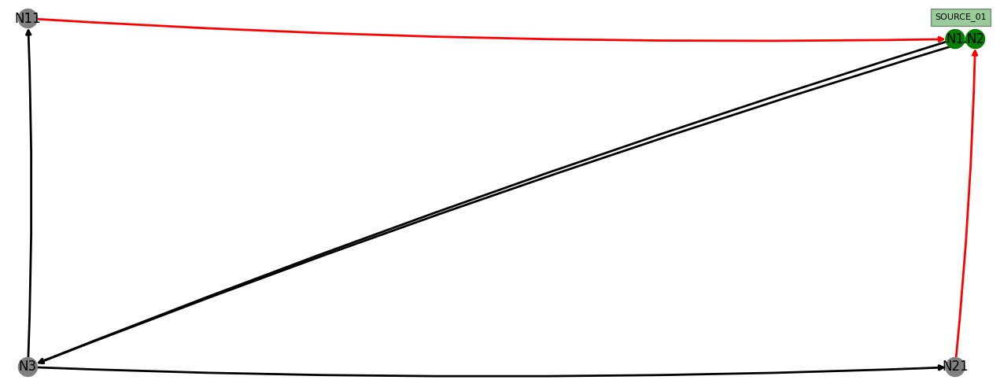

# LIF Analytics and Visuals
Provides a cli tool to read in LIF files (JSON) and visualize them using network x.

## Installation
This tool can be installed via `pip`:
```
sudo pip install .
```

### Dependencies
This tool relies on the following python packages:
- networkx
- matplotlib

## Usage

Call the tool using:

```
lif_visualizer -f <path to the LIF JSON file>
```
After that you can choose one of the available layouts by entering the corresponding number into the console and pressing enter.

### Optional Arguments:
- --hide-overlapping -> If set, hide overlapping station texts in the graph

### Legend and color maps
A simple layout is represented as follows:


The color of a `node` can either be:
- `Grey` : A normal node without a station marked for interaction
- `Green` : This node allows for interaction with a station

If a node allows for an interaction with a station, the station name is shown next to the node itself.
**Note**: If a station has multiple interaction nodes close to each other the text might overlap. This can be fixed by hiding overlapping text

The color of an `edge` indicates whether the node has to be traversed facing forwards or backwards:
- `Black` : This edge needs to be traversed while going `forward`
- `Red` : This edge needs to be traversed while going `backwards`
